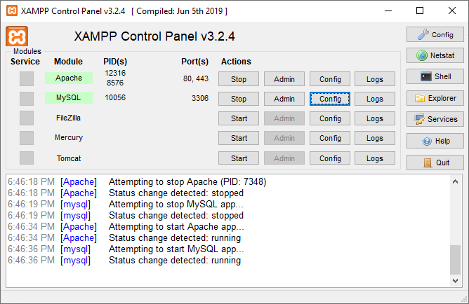
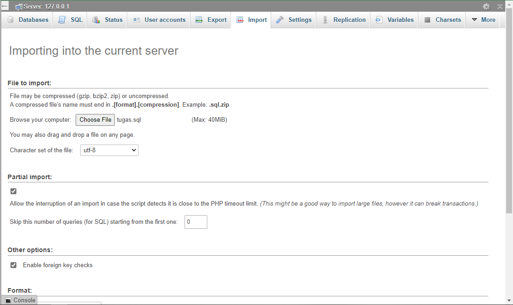
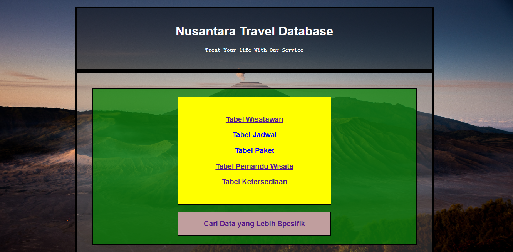

# Nusantara-Travel-Database

Prototype of Nusantara Travel Website with Database
## Step 1

Download and install xampp

https://www.apachefriends.org/pt_br/download.html

Choose the most compactible with your os

Follow the instuction to install there.

## Step 2

Run the app and start the Apache and MySQL

## Step 3

For your local platform on directory :

~~~
C:\xampp\htdocs
~~~

Download git with

~~~
git clone https://github.com/zainic/Nusantara-Travel-Database.git
~~~

and

~~~
cd Nusantara-Travel-Database
~~~

## Step 4

Run any browser and go to

http://localhost/phpmyadmin/

## Step 5

Import the sql file database from database directory

## Step 6

Finally open this website

http://localhost/Nusantara-Travel-Database/website_development/Project.html?

And you will get this view

